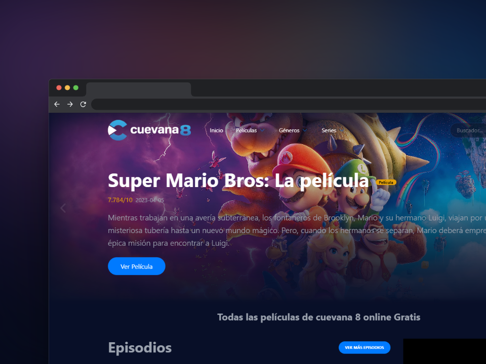

# Cuevana 8 Clon

Este proyecto es un clon de Cuevana 8, pero solo para fines de demostración. No permite ver películas, pero muestra cómo se podría estructurar un sitio similar. Está construido con Vite y utiliza la base de datos de themoviedatabase para obtener información sobre películas y series.

## Capturas de Pantalla

## Características

- Muestra una lista de películas populares en la página de inicio.
- Permite explorar Películas.
- Ofrece un botón para cargar más películas.
- Utiliza un carrusel para destacar películas.
- Diseño atractivo.

## Tecnologías Utilizadas

- Vite
- React
- React Router
- Tailwind CSS
- themoviedatabase API

## Uso

1. Clona este repositorio en tu máquina local.
2. Ejecuta `npm install` para instalar las dependencias.
3. Crea un archivo `.env` en la raíz del proyecto y agrega tu clave de API de themoviedatabase:
4. Ejecuta `npm run dev` para iniciar la aplicación en modo desarrollo.

## Contribución

Si deseas contribuir a este proyecto, sigue estos pasos:

1. Haz un fork del repositorio.
2. Crea una rama para tu característica (`git checkout -b nueva-caracteristica`).
3. Realiza tus cambios y haz commit (`git commit -m 'Agrega nueva característica'`).
4. Haz push a la rama (`git push origin nueva-caracteristica`).
5. Abre un pull request en GitHub.

## Autor

- André - [GitHub](https://github.com/andreponce3322)